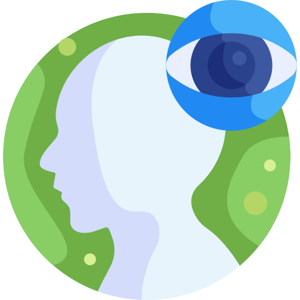
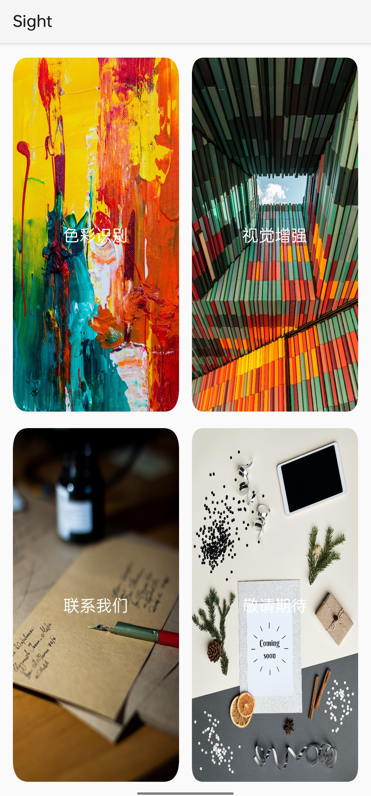

#  Sight
A visual enhancement android app.

This app can help visually impaired people to do some things they could not do without the help of others, such as identifying colors or enabling color impaired people to see objects with enhanced vision.

---
## 👀Notice
Part of the code for this project references [CameraFilter](https://github.com/nekocode/CameraFilter)

More details can be found [here](https://github.com/HYTYH/Sight/blob/main/docs/VisualEnhanceApp_Doc.pdf)

---
## ❔What can Sight do?
- color discrimination 
- Color reconstruction

---

## 🖼Runtime Screenshot

---

## ✉Contact Us

Feel free to open an issue if you have any questions about our project.
